# GymDiary fullstack-app

## Homepage

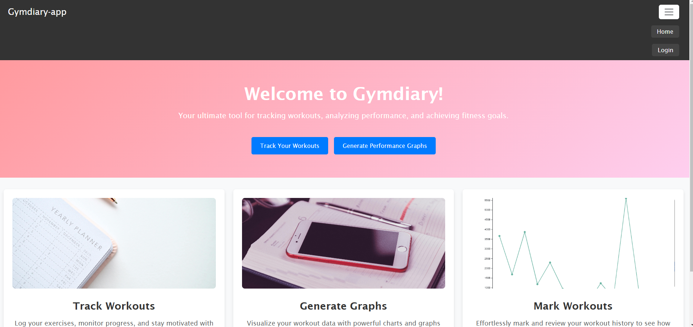

## Login

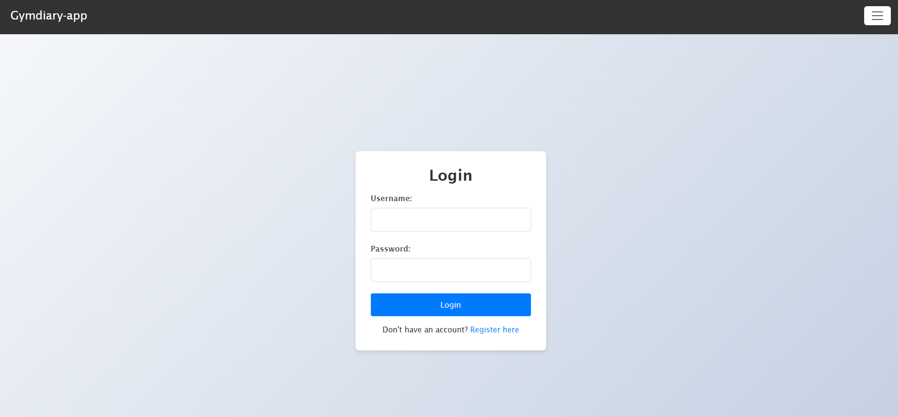
Login returns JWT to handle authentication during usage

## Registration

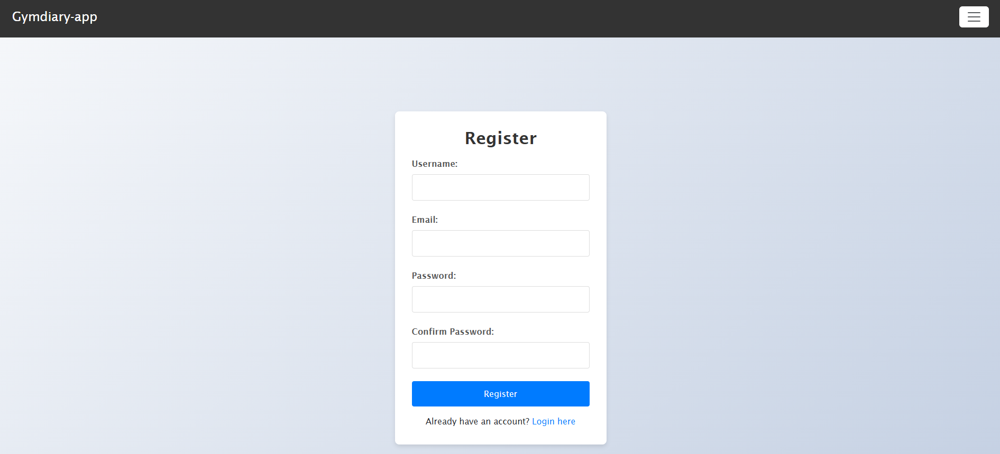
Registration hashes password with bcryptjs

## Adding workout template

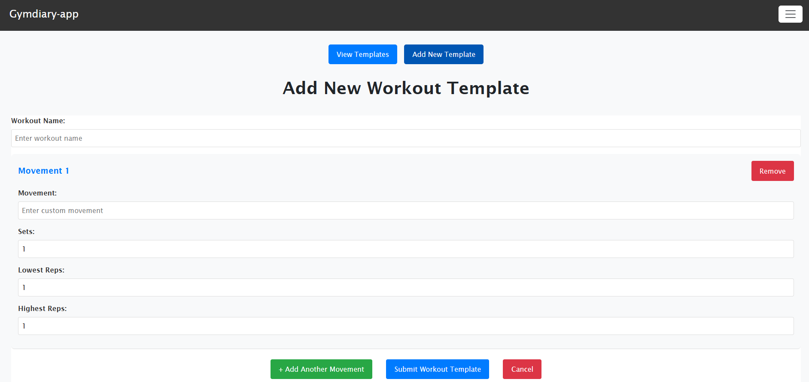
Creating view of workout templates

## Viewing workout templates

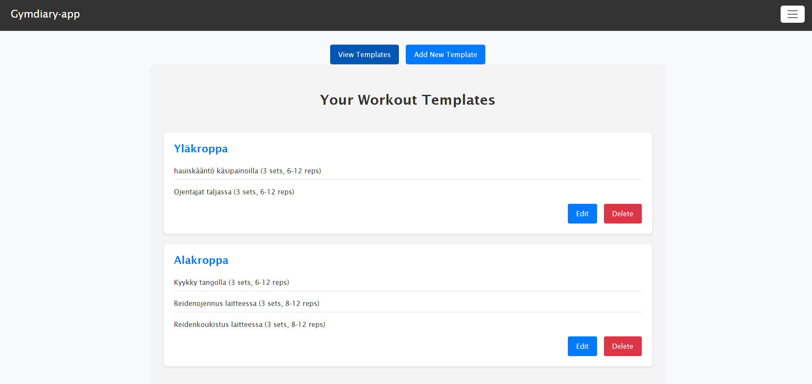
The view to edit or delete workout templates

## Adding workouts

### Selecting workout

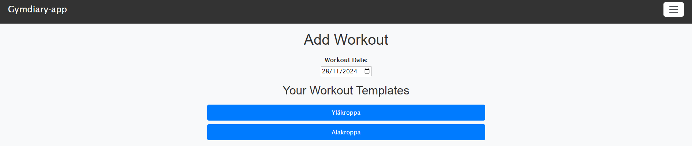
The view where user can select workout to do

### Form

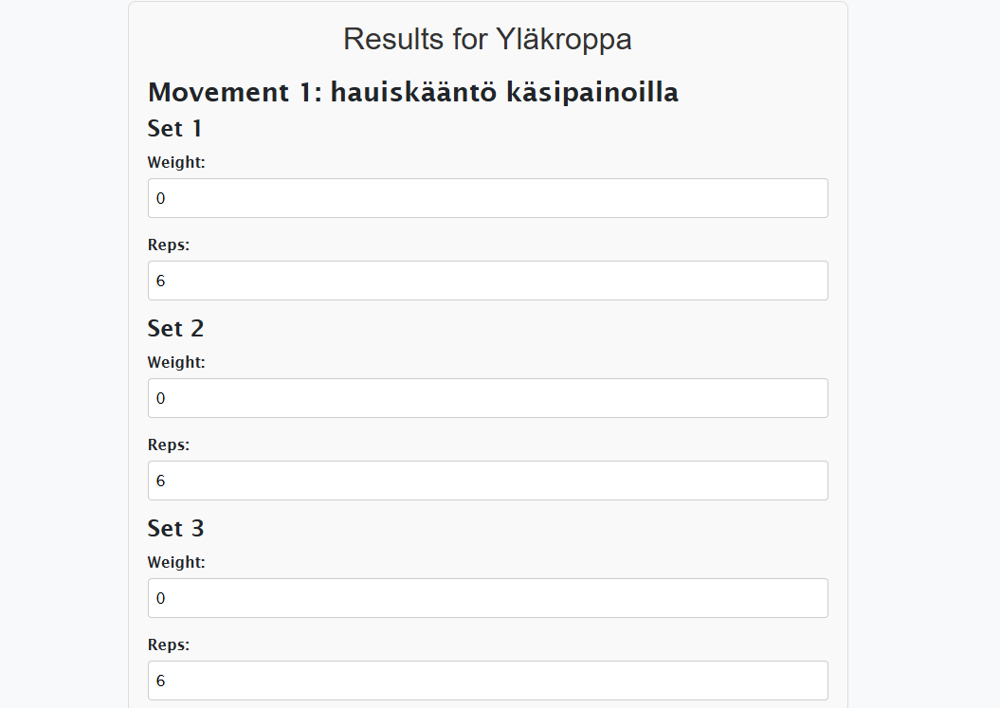
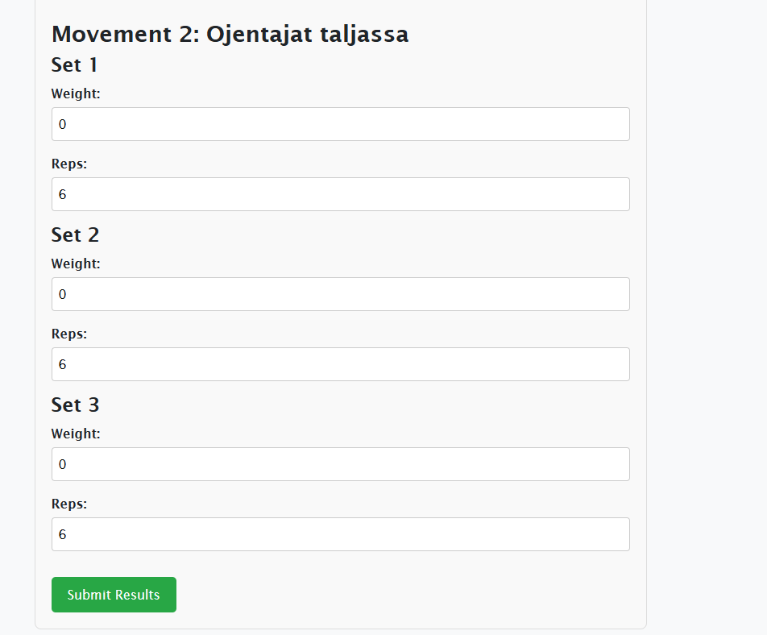
The form created based of workout template

## Viewing workout results

### View of workouts

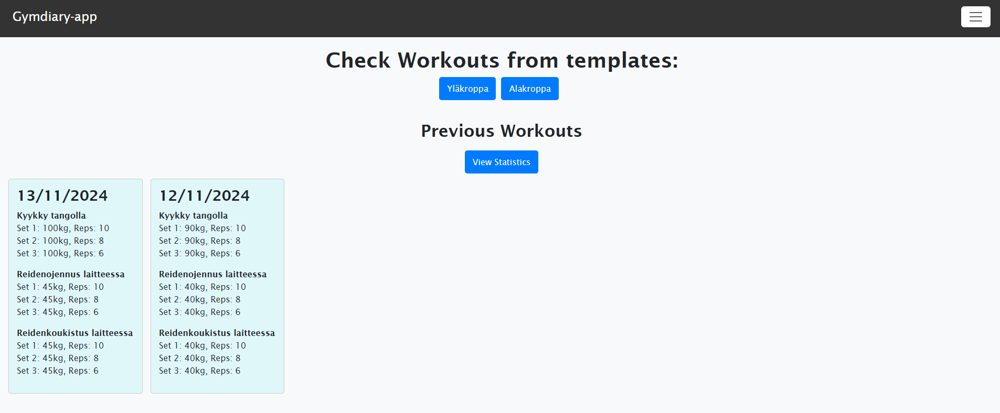
User can view workouts based on workout templates

### View of graphs based on workouts

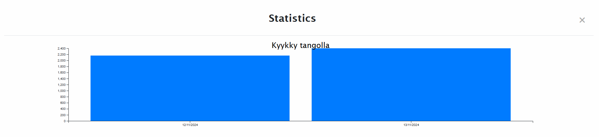
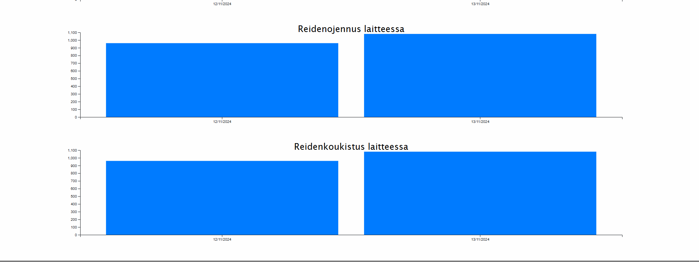
Graphs build with D3.js
